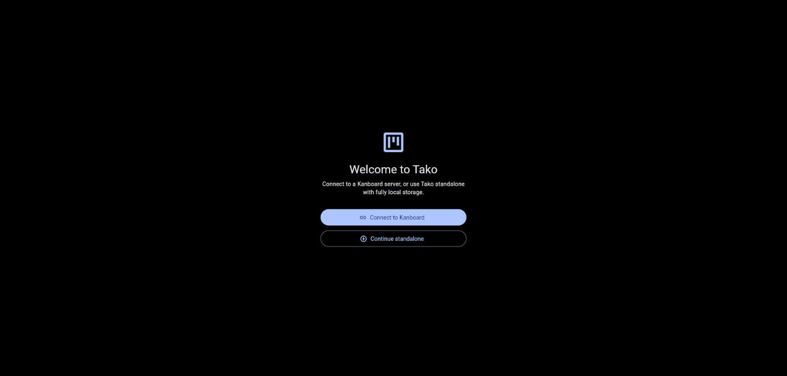
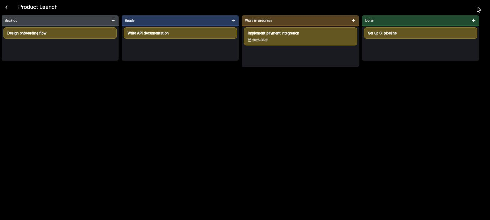
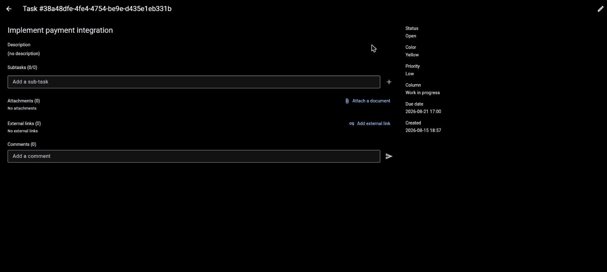

# Tako

A native, cross-platform Kanboard client built with Flutter. One codebase, every board, everywhere.


*Connect to a Kanboard server, or use Tako standalone with fully local storage.*


*Drag-and-drop kanban board with per-column theming, due-date badges, and click-and-drag reordering.*


*Full task detail view — subtasks, attachments, external links, comments, and metadata.*

## Background & Vision

Kanboard's own web UI works fine, but there's no first-class native client for it. Tako fills that gap: a single Flutter codebase that talks to Kanboard's JSON-RPC API and feels like a real desktop/mobile app rather than a browser tab — fast startup, native window chrome, and offline-friendly local caching.

It also works fully standalone with no server at all, using local storage only, for anyone who just wants a lightweight personal kanban board without standing up Kanboard.

## Features

- **Kanban board**: drag-and-drop cards between columns, click-and-drag reordering (no long-press wait), live drag feedback, and a brief highlight on the card you just moved so it doesn't get lost in a busy column.
- **Dual mode**: connect to any self-hosted Kanboard instance over its JSON-RPC API, or run fully standalone with local storage — same UI either way.
- **Task management**: title, description, color, priority, due dates, subtasks, attachments, external links, and comments.
- **Deadline watchdog**: background service that polls for due-soon and overdue tasks and fires deduplicated notifications, with fired-alert history persisted to disk so a restart doesn't re-notify.
- **Cross-platform**: Windows, macOS, and Linux desktop builds, plus a web build, from one codebase.

## Architecture

Tako talks to Kanboard through a generic JSON-RPC 2.0 client (`lib/api/kanboard_client.dart`) with typed error handling for both transport failures and API-level errors. A `TaskProvider` interface abstracts over two implementations — `KanboardProvider` (talks to a real server) and `LocalProvider` (fully offline, Hive-backed) — so the UI layer doesn't know or care which backend it's using.

The API layer was validated independently of the UI via plain-Dart CLI scripts in `bin/` before any widgets were built:

```
dart run bin/tako_cli.dart <baseUrl> <username> <password>       # exercises the JSON-RPC client end to end
dart run bin/watchdog_cli.dart <baseUrl> <username> <password>   # exercises the deadline watchdog
```

## Installation

Tako isn't published to app stores yet — build it from source:

```bash
git clone https://github.com/abduznik/Tako.git
cd Tako
flutter pub get
flutter run -d windows   # or macos / linux / chrome
```

Release builds:

```bash
flutter build windows --release   # build/windows/x64/runner/Release/tako.exe
flutter build macos --release
flutter build linux --release
flutter build web --release
```

### Connecting to Kanboard

You'll need a running [Kanboard](https://kanboard.org/) instance and a user's API token (or username/password). Enter the server URL and credentials on Tako's welcome screen, or choose "Continue standalone" to skip the server entirely and use local storage only.
